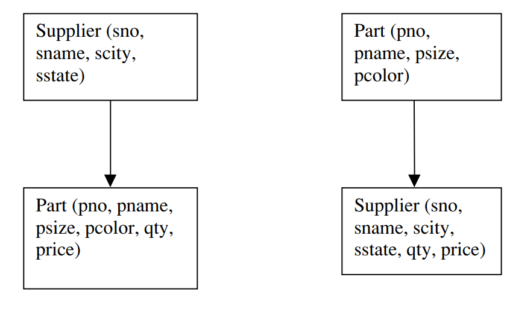
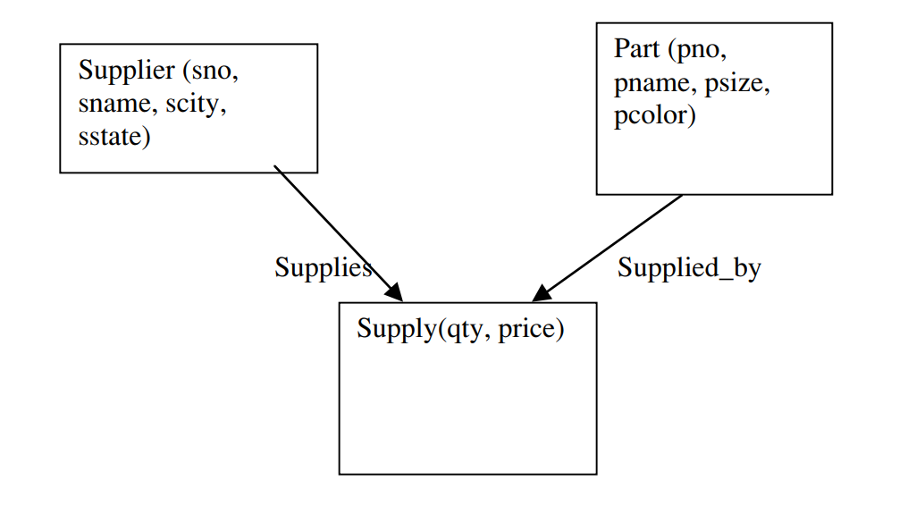

# The different era of Database development

# IMS Era

Structure : Hierarchical Structure(Tree) as shown :

Language: DL/1

Independence: logical data independence

Interface:  record-at-a-time interface

Cons: It is hard to represent some records with tree structured data

Lessons:

1.Physical and logical data independence are highly desirable;

2.Tree structured data models are very restrictive;

3.It is a challenge to provide sophisticated logical reorganizations of tree structured data;

4.A record-at-a-time user interface forces the programmer to do manual query optimization, and this is often hard.

# CODASYL Era

Structure: Hyperspace(Network) 

Language:

Independence: None data independence

Interface:  record-at-a-time interface

Cons: 

1.It is hard to represent some relationships more than  two-way relationship;

2.The hole network has to be loaded at once, and partial crash require a complete recovery.

Lessons:

1. Networks are more flexible than hierarchies but more complex;
2.  Loading and recovering networks is more complex than hierarchies

# Relational Era

Characteristics:

1. Store the data in a simple data structure (tables); (for logical data independence)
2. Access it through a high level set-at-a-time DML; (for physical data independence)

and the Char1 and Char2 lead to:

3. No need for a physical storage proposal.

Language: SQL(up to now)

Interface:  set-at-a-time interface

Lessons:

1. Set-a-time languages are good, regardless of the data model, since they offer much improved physical data independence;
2. Logical data independence is easier with a simple data model than with a complex one;
3. Technical debates are usually settled by the elephants of the marketplace, and often for reasons that have little to do with the technology;
4. Query optimizers can beat all but the best record-at-a-time DBMS application programmers.